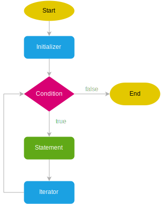
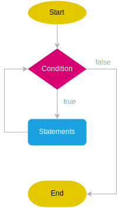
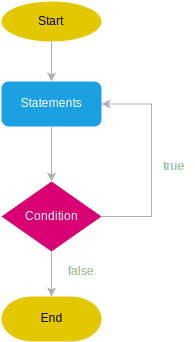

# JavaScript Session-4 Class Notes :rocket:

## Session-4 Loops

The **JavaScript loops** are used *to iterate the piece of code* using for, while, do while loops. It makes the code compact. It is mostly used in array.

In programming, loops are used to repeat a block of code.

For example, if you want to show a message 100 times, then you can use a loop. It's just a simple example; you can achieve much more with loops.

There are three types of loops in JavaScript. 

*And some variation of for loops( we will cover them later.)*

1. for loop
2. while loop
3. do-while loop

## For loop

The `for` loop is more complex, but it’s also the most commonly used loop.

The syntax of the `for` loop is:

```js
for (initializer; condition; iterator) {
    // for loop body
}
```

1. The **initializer** initializes and/or declares variables and executes only once.
2. The **condition** is evaluated.
   - If the condition is `false`, the `for` loop is terminated.
   - If the condition is `true`, the block of code inside of the `for` loop is executed.
3. The **iterator** updates the value of **initializer** when the condition is `true`.
4. The **condition** is evaluated again. This process continues until the condition is `false`.



In the `for` loop, the three expressions are *optional*. The following shows the `for` loop without any expressions:

```js
for ( ; ; ) {
   // statements
}
```

### A simple JavaScript for loop example

The following example uses the `for` loop statement to show numbers from 1 to 4 to console:

```js
for (let i = 1; i < 5; i++) {
  console.log(i);
}
```

Output:

```
1
2
3
4
```

> Use the JavaScript `for` statement to create a loop that execute a block based using various(start value, condition, steps) options.

## While loop

The most basic loop in JavaScript is the **while** loop. The purpose of a **while** loop is to execute a statement or code block repeatedly as long as an **expression** is true. Once the expression becomes **false,** the loop terminates.

The syntax of the `while` loop is:

```
while (condition) {
    // body of loop
}
```

Here,

1. A `while` loop evaluates the **condition** inside the parenthesis `()`.
2. If the **condition** evaluates to `true`, the code inside the `while` loop is executed.
3. The **condition** is evaluated again.
4. This process continues until the **condition** is `false`.
5. When the **condition** evaluates to `false`, the loop stops.



### JavaScript while loop example

The following example uses the `while` statement to output the odd numbers between 1 and 10 to the console:

```js
let count = 1;
while (count < 10) {
    console.log(count);
    count +=2;
}
```

Output:

```
1
3
5
7
9
```

> Use a `while` loop statement to create a loop that executes a block as long as a `condition` evaluates to `true`

## Do-While loop

The **do...while** loop is similar to the **while** loop except that the condition check happens at the end of the loop. This means that the loop will always be executed at least once, even if the condition is **false**.

The syntax of `do...while` loop is:

```js
do {
    // body of loop
} while(condition)
```

Here,

1. The body of the loop is executed at first. Then the **condition** is evaluated.
2. If the **condition** evaluates to `true`, the body of the loop inside the `do` statement is executed again.
3. The **condition** is evaluated once again.
4. If the **condition** evaluates to `true`, the body of the loop inside the `do` statement is executed again.
5. This process continues until the **condition** evaluates to `false`. Then the loop stops.



### Simple JavaScript do while statement example

The following example uses the `do...while` statement to output five numbers from 0 to 4 to the console:

```js
let count = 0;
do {
  console.log(count);
  count++;
} while (count < 5)
```

Output:

```
0
1
2
3
4
```

### Using the JavaScript do while statement to calculate sum of positive numbers

The following example uses the `do...while` statement to calculate sum of entered positive numbers till a negative number is entered.

```js
// to find the sum of positive numbers
// if the user enters negative number, the loop terminates
// negative number is not added to sum
let sum = 0;
let number = 0;
do {
    sum += number;
    number = parseInt(prompt('Enter a number: '));
} while(number >= 0)
console.log(`The sum is ${sum}.`);
```

**Output 1**

```
Enter a number: 2
Enter a number: 4
Enter a number: -500
The sum is 6.
```

> Use the `do…while` statement to create a loop that executes a block until a condition is `false`.
>
> This form of syntax should only be used when you want the body of the loop to execute **at least once** regardless of the condition being truthy. Usually, the other form is preferred: `while(…) {…}`.

### References

1. https://www.javatpoint.com/javascript-loop
2. https://developer.mozilla.org/en-US/docs/Web/JavaScript/Guide/Loops_and_iteration
3. https://www.programiz.com/javascript/for-loop
4. https://www.javascripttutorial.net/javascript-for-loop/
5. https://javascript.info/while-for#summary

