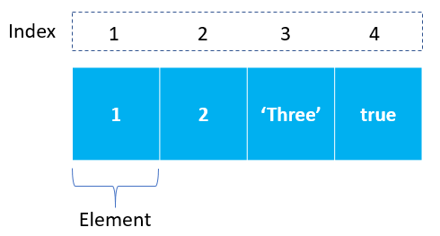

# JavaScript Session-7 Class Notes :rocket:

## Session-7 Arrays

In JavaScript, an array is an ordered list of values. Each cell is called an element by index. *(zero indexed, starting from zero as first element)*



An JavaScript array:

1. can hold values of mixed types: number, string, and boolean etc.
2. The size of an array is dynamic and auto-growing. 

You can create an array using two ways:

1. Using an array literal

The easiest way to create an array is by using an array literal `[]`. For example,

```js
const array1 = ["eat", "sleep"];
```

2. Using the new keyword

You can also create an array using JavaScript's `new` keyword.

```js
const array2 = new Array("eat", "sleep");
```

In both of the above examples, we have created an array having two elements.

> *It is recommended to use array literal to create an array.*

```js
// empty array
const myList = [];
// array of numbers
const numberArray = [ 2, 4, 6, 8];
// array of strings
const dailyActivities = [ 'eat', 'work', 'sleep'];
// array with mixed data types
const newData = ['work', 'exercise', 1, true];
// array with size
let scores = Array(10);
```

### Access an Array item using the index position

```js
let first = dailyActivities[0]
// eat

let last = dailyActivities[dailyActivities.length - 1]
// sleep
```


```js
const myArray = ['h', 'e', 'l', 'l', 'o'];
// first element
console.log(myArray[0]);  // "h"
// second element
console.log(myArray[1]); // "e"
// length
console.log(myArray.length); // 5
```

### Add, change and remove elements in arrays

use the built-in method `push()` and `unshift()` to add elements to an array.

The `push()` method adds an element at the end of the array. For example,

```js
let dailyActivities = ['eat', 'work', 'sleep'];

// add an element at the end
dailyActivities.push('exercise');

console.log(dailyActivities); //  ['eat', 'work', 'sleep', 'exercise']
```

The `unshift()` method adds an element at the beginning of the array. For example,

```js
let dailyActivities = [ 'eat', 'work', 'sleep'];

//add an element at the start
dailyActivities.unshift('get dressed'); 

console.log(dailyActivities); // ['get dressed', 'eat', 'work', 'sleep']
```

Add elements or change the elements by accessing the index value.

```js
let dailyActivities = [ 'eat', 'sleep'];

// this will add the new element 'exercise' at the 2 index
dailyActivities[2] = 'exercise';

console.log(dailyActivities); // ['eat', 'sleep', 'exercise']
```

Suppose, an array has two elements. If you try to add an element at index 3 (fourth element), the third element will be undefined:

```js
let dailyActivities = [ 'eat', 'sleep'];

// this will add the new element 'exercise' at the 3 index
dailyActivities[3] = 'exercise';

console.log(dailyActivities); // ["eat", "sleep", undefined, "exercise"]
```

The `pop()` method to remove the last element from an array, also returns the removed value. 

```js
let dailyActivities = ['work', 'eat', 'sleep', 'exercise'];
// remove the last element
dailyActivities.pop();
console.log(dailyActivities); // ['work', 'eat', 'sleep']
// remove the last element from ['work', 'eat', 'sleep']
const removedElement = dailyActivities.pop();
//get removed element
console.log(removedElement); // 'sleep'
console.log(dailyActivities);  // ['work', 'eat']
```

To remove the first element, use the `shift()` method, it also returns the removed element.

```js
let dailyActivities = ['work', 'eat', 'sleep'];
// remove the first element
dailyActivities.shift();
console.log(dailyActivities); // ['eat', 'sleep']
```

## Array Operations

- [Array length property](https://www.javascripttutorial.net/javascript-array-length/) – show you how to use the length property of an array effectively.
- [Array destructuring](https://www.javascripttutorial.net/es6/destructuring/) – show you how to assign the elements of an array to variables.
- [Spread operator](https://www.javascripttutorial.net/es6/javascript-spread/) – learn how to use the spread operator effectively.
- [push()](https://www.javascripttutorial.net/javascript-array-push/) – show you how to add an element to the end of an array.
- [pop()](https://www.javascripttutorial.net/javascript-array-pop/) – show you how to remove an element from the end of an array.
- [splice()](https://www.javascripttutorial.net/javascript-array-splice/) – manipulate elements in an array such as deleting, inserting, and replacing elements.
- [slice()](https://www.javascripttutorial.net/javascript-array-slice/) – copy elements of an array.
- [index()](https://www.javascripttutorial.net/javascript-array-indexof/) – locate an element in an array.
- [every()](https://www.javascripttutorial.net/javascript-every/) – check if every element in an array passes a test.
- [some()](https://www.javascripttutorial.net/javascript-array-some/) – check if at least one element in an array passed a test.
- [sort()](https://www.javascripttutorial.net/javascript-array-sort/) – sort elements in an array.
- [map()](https://www.javascripttutorial.net/javascript-array-map/) – transform array elements.
- [filter()](https://www.javascripttutorial.net/javascript-array-filter/) – filter elements in an array
- [forEach()](https://www.javascripttutorial.net/javascript-array-foreach/) – loop through array elements.
- [reduce()](https://www.javascripttutorial.net/javascript-array-reduce/) – reduce elements of an array to a value.
- [join()](https://www.javascripttutorial.net/javascript-array-join/) – concatenate all elements of an array into a string separated by a seperator.
- [flat()](https://www.javascripttutorial.net/es-next/javascript-array-flat/) – flatten an array recursively up to a specified depth.
- [flatMap()](https://www.javascripttutorial.net/es-next/javascript-array-flatmap/) – execute a mapping function on every element and flatten the result. It is the combination of the `map()` followed by the `flat()` method.
- [at() method](https://www.javascripttutorial.net/javascript-array-at/) – guide you on how to use the Array.prototype.at() method to access array elements.
- [of()](https://www.javascripttutorial.net/es6/array-of/) – improve array creation.
- [from()](https://www.javascripttutorial.net/es6/array-from/) – create arrays from array-like or iterable objects.
- [find()](https://www.javascripttutorial.net/es6/javascript-array-find/) – find an element in an array
- [findIndex()](https://www.javascripttutorial.net/es6/javascript-array-findindex/) – find the index of an element in an array.
- [includes()](https://www.javascripttutorial.net/es-next/javascript-array-includes/) – allow you to check if an element is in an array.
- [concat()](https://www.javascripttutorial.net/javascript-array-concat/) – merge two arrays into an array.
- [Multidimensional Array](https://www.javascripttutorial.net/javascript-multidimensional-array/) – learn how to work with multidimensional arrays in JavaScript.


### References

1. https://www.javatpoint.com/javascript-array
2. https://developer.mozilla.org/en-US/docs/Web/JavaScript/Reference/Global_Objects/Array
3. https://www.programiz.com/javascript/array
4. https://www.javascripttutorial.net/javascript-array/
5. https://javascript.info/array
6. https://javascript.info/array-methods
